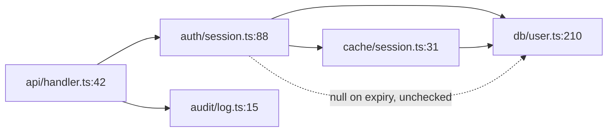

<!-- coding:deferred -->
# Diagram Forms — One Shape per Trigger

Purpose: the copy-paste form for each trigger, so a diagram costs a minute rather than a decision.
Read when: a finding has hit one of the triggers and the shape is not obvious.
Source: none — the shapes are this set's own; nothing outside the page can move them.
Verified: 2026-08-23 — no automated check reads the drawings. What is checked is
that this page and `visualise` between them define every trigger, form and floor
word the registry declares; a rule in this set's validator (V36) re-runs that on
every commit, so a word deleted from here fails the build.

## Forms

Four shapes, one per trigger, cover almost everything, and the fan is the `hops`
form turned outwards. Pick by trigger, not by taste.

## `hops` — the call chain

The default here. Left to right, one arrow per step, each node a place that was
opened. Hang the finding off the step it is at.

```
api/handler.ts:42 ──▶ auth/session.ts:88 ──▶ db/user.ts:210
                            │
                            └─ returns null on an expired token;
                               :210 dereferences it without a check
```

Where the path branches, put the branch that matters below and say what takes
it. Two arrows out of one node with no condition on them is a diagram that has
not decided what it is claiming.

**The fan** is the same form when the finding is that a change reaches further
than the diff: the changed thing on the left, its callers to the right, and the
ones the diff did not touch marked.

```
auth/session.ts:88  getUser(id) ──▶ getUser(id, opts)
    ├──▶ api/handler.ts:42     updated in this diff
    ├──▶ jobs/cleanup.ts:17    updated in this diff
    └──▶ admin/export.ts:63    NOT in the diff — still passes one argument
```

## `disagreement` — two columns

Both sides, one row per property, the disagreement on its own line.

```
                  the code computes     the caller expects
unit              cents                 dollars            ← disagree
on error          returns 0             throws
rounding          truncates             half-up            ← disagree
```

Also the form for a value against a schema, a constant against its test, or a
migration against the column it writes.

## `ordering` — two lanes

Time to the right, one lane per actor, and the mark where the interleaving goes
wrong. Only when the order is the finding — if any order fails, it is `hops`.

```
req A   read bal ─────────────┐            ┌── write bal
req B          read bal ──────┴── write ───┘
                                          ▲ A writes over B, from a stale read
```

## `location` — the case grid

Code is not two-dimensional, so this fires as a grid: the inputs down one axis,
the states across, and the empty cell as the finding.

```
                 session fresh   session expired   session revoked
read request          ok              ok                ok
write request         ok              ——                ok      ← no branch; falls through to :210
```

## Mermaid, when it is a graph

More than about six nodes, or branching and merging that ASCII would misalign.
It needs a renderer, so it is a trade.

````

````

Keep node labels to what was opened. A mermaid graph is as easy to fill with
untraced edges as a sentence is, and harder to argue with, which is the danger.

## Drawing them

- Box characters `┌ ┐ └ ┘ ├ ┤ ┬ ┴ ┼ │ ─`, arrows `──▶ ▲ ▼ └─`
- Keep the whole thing under about 70 columns so nothing wraps in a terminal
- Circled numbers `① ② ③` for marks; they survive being pasted anywhere
- Align by spaces, never tabs
- A legend under the drawing, not inside it

## What none of these do

They do not carry evidence. A map shows where a finding is, not that anyone
looked — the grade beside the finding says that, and a beautifully drawn
`asserted` is still `asserted`.
